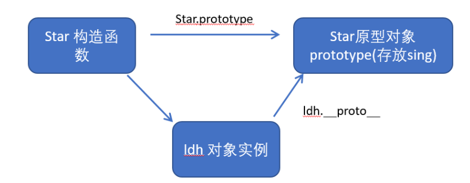

### question1：说说你对原型链的理解/prototype(原型)与_proto_(原型链)？

1. 原型prototype：
+ JavaScript 规定，每一个构造函数都有一个prototype 属性，指向另一个对象。注意这个prototype就是一个对象，这个对象的所有属性和方法，都会被构造函数所拥有。
+ 我们可以把那些不变的方法，直接定义在 prototype 对象上，这样所有对象的实例就可以共享这些方法。
  ``` 
  function Star(uname, age) {
      this.uname = uname;
      this.age = age;
  }
  Star.prototype.sing = function() {
  	console.log('我会唱歌');
  }
  var ldh = new Star('刘德华', 18);
  var zxy = new Star('张学友', 19);
  ldh.sing();//我会唱歌
  zxy.sing();//我会唱歌
  ```
2. 原型链_proto_   
  + 对象都会有一个属性 __proto__ 指向构造函数的 prototype 原型对象，之所以我们对象可以使用构造函数 prototype 原型对象的属性和方法，就是因为对象有 __proto__ 原型的存在。
__proto__对象原型和原型对象 prototype 是等价的
__proto__对象原型的意义就在于为对象的查找机制提供一个方向，或者说一条路线，但是它是一个非标准属性，因此实际开发中，不可以使用这个属性，它只是内部指向原型对象 prototype

3. constructor构造函数 :
   对象原型（ __proto__）和构造函数（prototype）原型对象里面都有一个属性 constructor 属性 ，constructor 我们称为构造函数，因为它指回构造函数本身。
constructor 主要用于记录该对象引用于哪个构造函数，它可以让原型对象重新指向原来的构造函数。
一般情况下，对象的方法都在构造函数的原型对象中设置。如果有多个对象的方法，我们可以给原型对象采取对象形式赋值，但是这样就会覆盖构造函数原型对象原来的内容，这样修改后的原型对象 constructor  就不再指向当前构造函数了。此时，我们可以在修改后的原型对象中，添加一个 constructor 指向原来的构造函数。

### question2: 说说你对闭包的理解？
1. 什么是闭包？ 闭包（closure）指有权访问另一个函数作用域中变量的函数。简单理解就是 ，一个作用域可以访问另外一个函数内部的局部变量。
2. 闭包的作用：延伸变量的作用范围。
    ```
     function fn() { // fn就是闭包函数
       var num = 10;
       function fun() {
           console.log(num);
     	}
        return fun;
     }
    var f = fn();
    f();
    ```

### question3: this指向问题
+ constructor中的this指向的是new出来的实例对象 
+ 自定义的方法,一般也指向的new出来的实例对象
+ 绑定事件之后this指向的就是触发事件的事件源
+ 箭头函数的this一层一层的往上走

### question4: 说说数组有哪些方法？
1. push()
2. pop()
3. shift() 从数组中删除第一个元素，并返回该元素的值。此方法更改数组的长度
4. unshift() 方法将一个或多个元素添加到数组的开头，并返回该数组的新长度(该方法修改原有数组)。
5. concat() 方法用于合并两个或多个数组。此方法不会更改现有数组，而是返回一个新数组
6. slice()[切割] 方法返回一个新的数组对象，这一对象是一个由 begin 和 end 决定的原数组的浅拷贝（包括 begin，不包括end）。原始数组不会被改变。
7. splice() 方法通过删除或替换现有元素或者原地添加新的元素来修改数组,并以数组形式返回被修改的内容。此方法会改变原数组
8. find() 方法返回数组中满足提供的测试函数的第一个元素的值。否则返回 undefined。
9. filter() 对数组的每项元素进行过滤得到新数组
10. map() 对每个元素单独进行运算
11. reduce() 对数组的每个元素前后进行汇总

### question5: 说说es6语法？
1. 
+ let 只在所处的块级有效 1.不存在变量提升 2.暂时性死区
+ const 常量(值/内存地址不能变化的量)
2. 解构赋值
+ 数组解构
`let [a, b, c] = [1, 2, 3];`
+ 对象解构 
``` 
let person = { name: 'zhangsan', age: 20 }; 
 let { name, age } = person;
 ```
3. 箭头函数
 + 什么时候使用箭头函数： 当把某一个函数作为参数传递到例外一个函数中时
 + 箭头函数中的this指向：向外层作用域中，一层层查找this，直到有this的定义
4. 剩余参数
+ 剩余参数语法允许我们将一个不定数量的参数表示为一个数组，不定参数定义方式，这种方式很方便的去声明不知道参数情况下的一个函数
  ```
  function sum (first, ...args) {
       console.log(first); // 10
       console.log(args); // [20, 30] 
   }
   sum(10, 20, 30)
   ```
5. String的扩展方法: 模板字符串(***)
+ 模板字符串中可以解析变量
  ```
  let name = '张三'; 
  let sayHello = `hello,my name is ${name}  `; // hello, my name is zhangsan
  ```
+ 模板字符串中可以换行
+ 在模板字符串中可以调用函数
